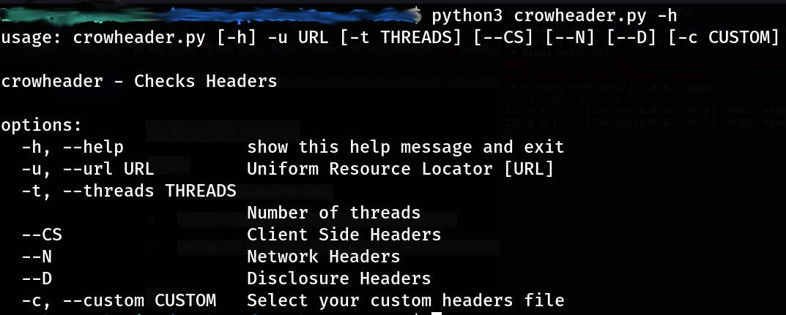
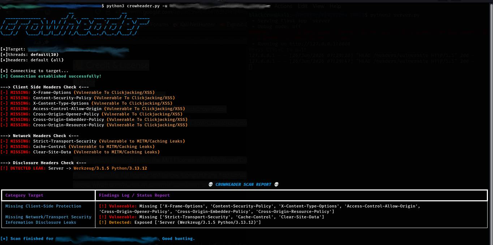
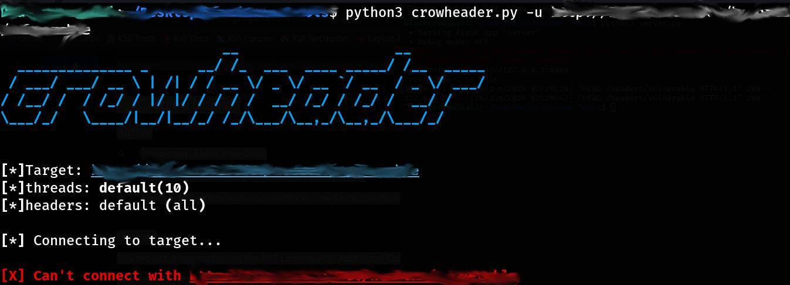

# crowheader 🦅

[](https://www.kali.org)
[](https://python.org)
[](https://github.com/BlackCrow-Code/crowheader/blob/main/LICENSE)

An advanced, high-performance, and lightweight security intelligence tool engineered for penetration testers and web security auditors. Fully developed and optimized inside **Kali Linux**, this tool evaluates HTTP server response profiles, maps missing defensive security policies, and intercepts passive backend information disclosure leaks with extreme efficiency.

---

## 🚀 Key Features

* **Target Profiling Segmentation:** Scan specific security matrices via isolated flags (`--CS` Client-Side, `--N` Network, `--D` Disclosure).
* **Failsafe Connection Engine:** Integrated network sandbox handler that captures active headers or handles unreached/dead hosts instantly without script crashes.
* **Custom Signature Matching:** Feed specialized corporate wordlists (`-c`) to check and align target parameters against known infrastructure headers.
* **Robust Terminal UI/UX:** Powered by the `rich` library, featuring an active real-time dot animation spinner and a clean, post-scan metrics summary dashboard.
* **Graceful Exception Handling:** Fully optimized to intercept sudden manual user interruptions (`Ctrl+C`) cleanly without cluttering the screen with stack traces.

---

## 📸 Screenshots & Showcase

### 1. Help Menu & Argument Parser
*The neat, organized CLI guide showcasing all available custom arguments and parameters.*


### 2. Full Successful Scan Breakdown
*Below is the complete dashboard summary showing the structured table report and categorized metrics logs after a thorough target inspection.*


### 3. Connection Layer Failure Handling / Interruption
*Illustrating the failsafe execution block catching remote server socket drops or closed ports seamlessly.*


---

## 🛠️ Installation & Setup

Since it's built and fully compatible with **Kali Linux**, clone the repository and install the dependencies directly:

```bash
# Clone the repository
git clone https://github.com/BlackCrow-Code/crowheader

# Navigate into the project directory
cd crowheader

# Install required packages
pip install -r requirements.txt
```
## 📖 Usage Guide & Examples
Help Options

To view all available parameters, filters, and configuration guides:

```bash
python3 crowheader.py -h
```
Basic Full Profile Audit Scan
Bash
```bash
python3 crowheader.py -u example.com
```
Advanced Profile Filtering & Custom Signature Auditing

Isolate the scan to monitor only Client-Side and Transport Network layers while feeding a custom wordlist signature file to check specific hidden vectors:
```bash
python3 crowheader.py -u https://example.com--CS --N -c custom_headers.txt
```
## ⚙️ Available Arguments

Argument	Long Flag	Description	Default

-u	--url	[Required] The target Uniform Resource Locator	None

-t	--threads	Number of concurrent connection threads allocated	10

--CS	--CS	Filter scan exclusively for Client-Side Protection Profiles	False

--N	--N	Filter scan exclusively for Network/Transport Profiles	False

--D	--D	Filter scan exclusively for Infrastructure Disclosure Profiles	False

-c	--custom	Path to your custom signature payload profiling file	None

## ⚠️ Additional Terms, Disclaimer & Advice

[!WARNING]
1. Legal & Ethical Use Only

Notwithstanding the permissions granted in the MIT License, the use of this software ("crowbuster") for any illegal activities, unauthorized cyber operations, malicious hacking, or any action that causes harm to individuals or organizations is strictly prohibited. This software is intended solely for educational, research, and authorized ethical security testing purposes.

[!IMPORTANT]
2. Developer Disclaimer 

The developer (BlackCrow-Code) is absolutely NOT responsible for any misuse, unethical deployment, or illegal damage caused by this tool. By utilizing this software, you agree to take full legal and ethical liability for your actions and your scanning targets.

[!TIP]
3. Professional Security Advice 

Always ensure you have written, explicit authorization (such as an active Bug Bounty scope or an official Pentest agreement) before initiating any automated scan against a target. Unauthorized fuzzing can be flagged as a cyber attack, impact service availability, or result in permanent IP bans. Stay ethical, keep learning, and use your skills strictly to build and secure.


📜 Credit & License
Author

Developer: BlackCrow-Code

Source Profile: https://github.com/BlackCrow-Code

 License URL: https://github.com/BlackCrow-Code/crowheader/blob/main/LICENSE

License

This project is licensed under the MIT License with Additional Custom Developer Terms.
